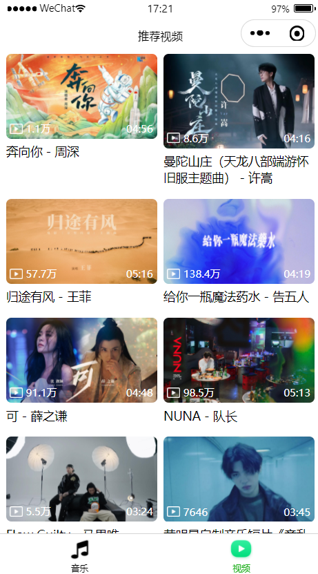
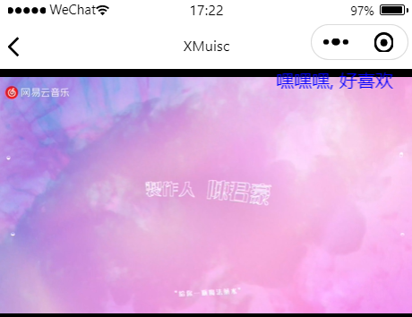

# X-Music

一个个人听歌的微信小程序，使用开源网易云接口进行开发，感谢提供开源。

## Recommended IDE Setup

**微信开发者工具**

## Customize configuration

请看 [微信小程序官方文档](https://developers.weixin.qq.com/miniprogram/dev/framework/).

## Project Setup

```sh
npm install
```

## 预览图

------







